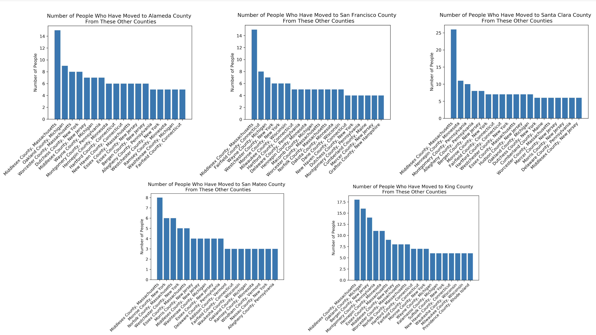
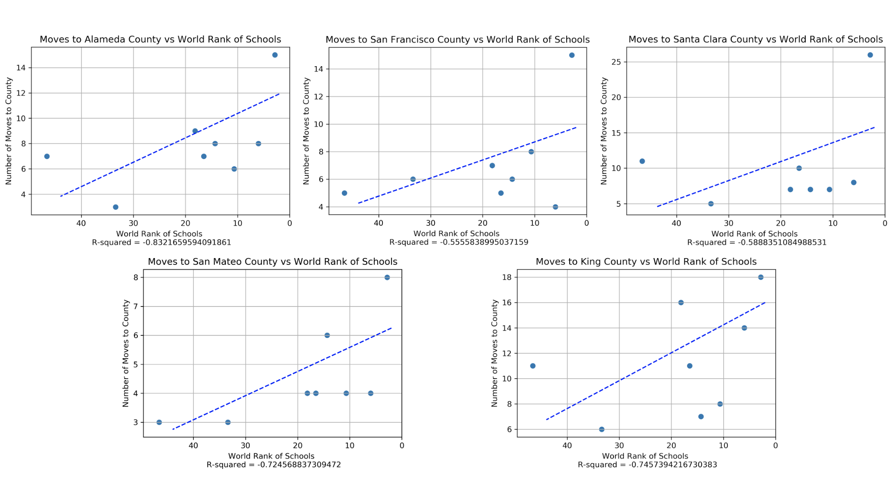
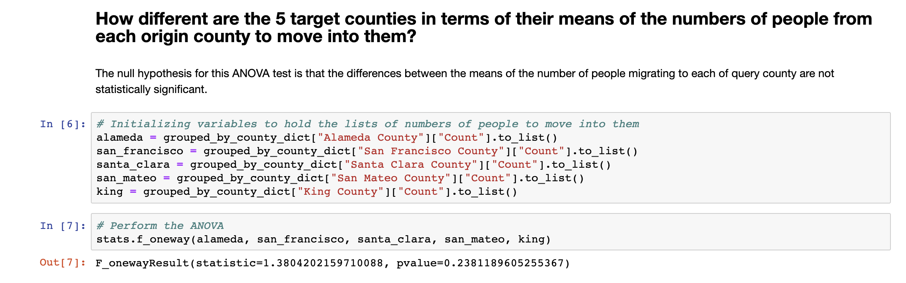

# Project-1 Analyzing trends in migration to the San Francisco Bay Area

Since 2010, the nine counties that make up the San Francisco Bay Area have seen their combined population increase by over 600,000 people, which is an increase of roughly 8.5%. Many Bay Area natives point to expansions and growth in the tech sector which many Bay Area counties have become home to as the reason for the increase. In this project, we used migration data from the US Census Bureau ACS Migration Flows API to determine the origin counties that the majority of people moving to the San Francisco Bay Area move from. We discovered that the majority of immigrants to the Bay Area move from US counties that are home to top-ranking universities with strong technology and business programs. We used linear regression to show a moderate to strong correlation between the highest rank of a university in a given county and the number of immigrants that county contributes to the Bay Area. We then used ANOVA tests to determine whether each Bay Area county experiences a similar distributions of movers from other US counties, as well as whether this distribution is see by other counties that are not home to thriving tech ecosystems. Through these tests we showed that all of the Bay Area counties are experiencing a similar migration pattern and that this pattern is dissimilar from those experienced by counties with less vibrant tech ecosystems.

